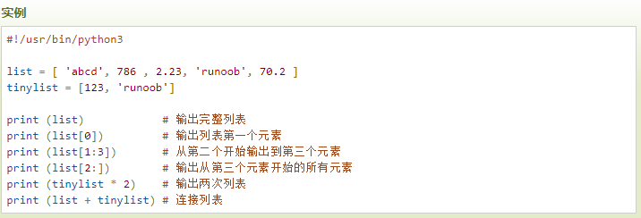
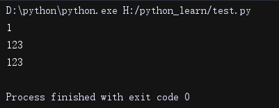
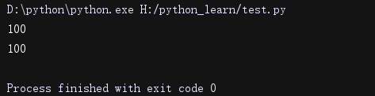
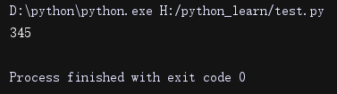

Python学习笔记
==============

基础
----

### 1.1 概念

**Python
是一种解释型语言：** 这意味着开发过程中没有了编译这个环节。类似于PHP和Perl语言。

**Python
是交互式语言：** 这意味着，您可以在一个Python提示符，直接互动执行写你的程序。

**Python
是面向对象语言:** 这意味着Python支持面向对象的风格或代码封装在对象的编程技术。

**Python 是初学者的语言：**Python
对初级程序员而言，是一种伟大的语言，它支持广泛的应用程序开发，从简单的文字处理到
WWW 浏览器再到游戏。

### 语法

#### 编码

默认情况下，Python 3 源码文件以 **UTF-8** 编码，所有字符串都是 unicode 字符串。

#### 标识符

-   第一个字符必须是字母表中字母或下划线 **\_** 。

-   标识符的其他的部分由字母、数字和下划线组成。

-   标识符对大小写敏感。在 Python 3 中，非 ASCII 标识符也是允许的了。

#### 注释

单行

\# 第一个注释

print ("Hello, Python!") \# 第二个注释

多行

'''

第三注释

第四注释

'''

或者

"""

第五注释

第六注释

"""

#### 行与缩进

python最具特色的就是使用缩进来表示代码块，不需要使用大括号 **{}** 。

缩进的空格数是可变的，但是同一个代码块的语句必须包含相同的缩进空格数

if True:

print ("Answer")

print ("True")

else:

print ("Answer")

print ("False") \# 缩进不一致，会导致运行错误

#### 多行语句

Python
通常是一行写完一条语句，但如果语句很长，我们可以使用反斜杠(\\)来实现多行语句，例如：

total = item_one + \\

item_two + \\

item_three

在 [], {}, 或 () 中的多行语句，不需要使用反斜杠(\\)，例如：

total = ['item_one', 'item_two', 'item_three',

'item_four', 'item_five']

#### 字符串

-   python中单引号和双引号使用完全相同。

-   使用三引号('''或""")可以指定一个多行字符串。

-   转义符 '\\'

-   自然字符串， 通过在字符串前加r或R。 如 r"this is a line with \\n"
    则\\n会显示，并不是换行。

-   python允许处理unicode字符串，加前缀u或U， 如 u"this is an unicode string"。

-   字符串是不可变的。

-   按字面意义级联字符串，如"this " "is " "string"会被自动转换为this is string。

-   word = '字符串'

-   sentence = "这是一个句子。"

-   paragraph = """这是一个段落，

-   可以由多行组成"""

#### 空行

函数之间或类的方法之间用空行分隔，表示一段新的代码的开始。类和函数入口之间也用一行空行分隔，以突出函数入口的开始。

空行与代码缩进不同，空行并不是Python语法的一部分。书写时不插入空行，Python解释器运行也不会出错。但是空行的作用在于分隔两段不同功能或含义的代码，便于日后代码的维护或重构。

**记住：**空行也是程序代码的一部分。

#### 多个语句构成代码组

缩进相同的一组语句构成一个代码块，我们称之代码组。

像if、while、def和class这样的复合语句，首行以关键字开始，以冒号( :
)结束，该行之后的一行或多行代码构成代码组。

我们将首行及后面的代码组称为一个子句(clause)。

如下实例：

if expression :

suite

elif expression :

suite

else :

suite

#### Print 输出

print 默认输出是换行的，如果要实现不换行需要在变量末尾加上 **end=""**：

\#!/usr/bin/python3

x="a"

y="b"

\# 换行输出

print( x )

print( y )

print('---------')

\# 不换行输出

print( x, end=" " )

print( y, end=" " )

print()

以上实例执行结果为：

a

b

\---------

a b

#### import 与 from...import

在 python 用 **import** 或者 **from...import** 来导入相应的模块。

将整个模块(somemodule)导入，格式为： **import somemodule**

从某个模块中导入某个函数,格式为： **from somemodule import somefunction**

从某个模块中导入多个函数,格式为： **from somemodule import firstfunc,
secondfunc, thirdfunc**

将某个模块中的全部函数导入，格式为： **from somemodule import \***

help() 函数

调用 python 的 help() 函数可以打印输出一个函数的文档字符串：

\# 如下实例，查看 max 内置函数的参数列表和规范的文档

\>\>\> help(max)

……显示帮助信息……

### python3 的基本数据类型

Python
中的变量不需要声明。每个变量在使用前都必须赋值，变量赋值以后该变量才会被创建。

在 Python
中，变量就是变量，它没有类型，我们所说的"类型"是变量所指的内存中对象的类型。

等号（=）用来给变量赋值。等号（=）运算符左边是一个变量名,等号（=）运算符右边是存储在变量中的值。

多个变量赋值

a = b = c = 1 \# 或者

a, b, c = 1, 2, "runoob"

#### 标准数据类型

**Number（数字）String（字符串）List（列表）Tuple（元组）Sets（集合）Dictionary（字典）**

##### Number（数字）

Python3 支持 **int、float、bool、complex（复数）**。

（复数的实部a和虚部b都是浮点型）

在Python 3里，只有一种整数类型 int，表示为长整型，没有 python2 中的 Long。

\>\>\> a, b, c, d = 20, 5.5, True, 4+3j

\>\>\> print(type(a), type(b), type(c), type(d))

\<class 'int'\> \<class 'float'\> \<class 'bool'\> \<class 'complex'\>

注意：在 Python2 中是没有布尔型的，它用数字 0 表示 False，用 1 表示 True。到
Python3 中，把 True 和 False 定义成关键字了，但它们的值还是 1 和
0，它们可以和数字相加。

当你指定一个值时，Number 对象就会被创建：

var1 = 1

var2 = 10

**数值运算**

\>\>\>5 + 4 \# 加法 9

\>\>\> 4.3 - 2 \# 减法 2.3

\>\>\> 3 \* 7 \# 乘法 21

\>\>\> 2 / 4 \# 除法，得到一个浮点数 0.5

\>\>\> 2 // 4 \# 除法，得到一个整数 0

\>\>\> 17 % 3 \# 取余 2

\>\>\> 2 \*\* 5 \# 乘方 32

**注意：**

-   1、Python可以同时为多个变量赋值，如a, b = 1, 2。

-   2、一个变量可以通过赋值指向不同类型的对象。

-   3、数值的除法（/）总是返回一个浮点数，要获取整数使用//操作符。

-   4、在混合计算时，Python会把整型转换成为浮点数。

-   Python
    数字数据类型用于存储数值。数据类型是不允许改变的,这就意味着如果改变数字数据类型的值，将重新分配内存空间。

-   相同的数值对应着相同的内存空间

##### String（字符串）

Python中的字符串用单引号(')或双引号(")括起来，同时使用反斜杠(\\)转义特殊字符。

-   **一些例子：**

\#!/usr/bin/python3

str = 'Runoob'

print (str) \# 输出字符串

print (str[0:-1]) \# 输出第一个到倒数第二个的所有字符

print (str[0]) \# 输出字符串第一个字符

print (str[2:5]) \# 输出从第三个开始到第五个的字符

print (str[2:]) \# 输出从第三个开始的后的所有字符

print (str \* 2) \# 输出字符串两次

print (str + "TEST") \# 连接字符串

Python
使用反斜杠(\\)转义特殊字符，如果你不想让反斜杠发生转义，可以在字符串前面添加一个
r，表示原始字符串：

\>\>\> print('Ru\\noob')

Ru

oob

\>\>\> print(r'Ru\\noob')

Ru\\noob

\>\>\>

*注：与 C 字符串不同的是，Python
字符串不能被改变。向一个索引位置赋值，比如word[0] = 'm'会导致错误。*

-   **Python字符串格式化**

常用：

print ("我叫 %s 今年 %d 岁!" % ('小明', 10))

我叫 小明 今年 10 岁!

Python2.6
开始，新增了一种格式化字符串的函数 [str.format()](http://www.runoob.com/python/att-string-format.html)，它增强了字符串格式化的功能。

-   **Python三引号**

三引号让程序员从引号和特殊字符串的泥潭里面解脱出来，自始至终保持一小块字符串的格式是所谓的WYSIWYG（所见即所得）格式的。

一个典型的用例是，当你需要一块HTML或者SQL时，这时用字符串组合，特殊字符串转义将会非常的繁琐。

errHTML = ''' \<HTML\>\<HEAD\>\<TITLE\>

Friends CGI Demo\</TITLE\>\</HEAD\>

\<BODY\>\<H3\>ERROR\</H3\>

\<B\>%s\</B\>\<P\>

\<FORM\>\<INPUT TYPE=button VALUE=Back

ONCLICK="window.history.back()"\>\</FORM\>

\</BODY\>\</HTML\> '''

cursor.execute('''

CREATE TABLE users (

login VARCHAR(8),

uid INTEGER,

prid INTEGER)

''')

-   **Unicode 字符串**

##### List（列表）

List（列表） 是 Python 中使用最频繁的数据类型。

列表可以完成大多数集合类的数据结构实现。列表中元素的类型可以不相同，它支持数字，字符串甚至可以包含列表（所谓嵌套）。

列表是写在方括号[ ]之间、用逗号分隔开的元素列表。

['abcd', 786, 2.23, 'runoob', 70.2]

abcd

[786, 2.23]

[2.23, 'runoob', 70.2]

[123, 'runoob', 123, 'runoob']

['abcd', 786, 2.23, 'runoob', 70.2, 123, 'runoob']

*注：与Python字符串不一样的是，列表中的元素是可以改变的*

##### Tuple（元组）

元组（tuple）与列表类似，不同之处在于元组的元素不能修改。元组写在小括号**()**里，元素之间用逗号隔开。

元组中的元素类型也可以不相同：

\>\>\>tup = (1, 2, 3, 4, 5, 6)

\>\>\> print(tup[0])

1

\>\>\> print(tup[1:5])

(2, 3, 4, 5)

\>\>\> tup[0] = 11 \# 修改元组元素的操作是非法的

\#!/usr/bin/python3

tuple = ( 'abcd', 786 , 2.23, 'runoob', 70.2 )

tinytuple = (123, 'runoob')

print (tuple) \# 输出完整元组

print (tuple[0]) \# 输出元组的第一个元素

print (tuple[1:3]) \# 输出从第二个元素开始到第三个元素

print (tuple[2:]) \# 输出从第三个元素开始的所有元素

print (tinytuple \* 2) \# 输出两次元组

print (tuple + tinytuple) \# 连接元组

*注： 1. 虽然tuple的元素不可改变，但它可以包含可变的对象，比如list列表*

*2. string、list和tuple都属于sequence（序列）。*

##### Set（集合）

集合（set）是一个无序不重复元素的序列。

基本功能是进行成员关系测试和删除重复元素。

可以使用大括号 **{ }** 或者 **set()** 函数创建集合

*注意：创建一个空集合必须用 set() 而不是 { }，因为 { } 是用来创建一个空字典。*

Eg：

student = {'Tom', 'Jim', 'Mary', 'Tom', 'Jack', 'Rose'}

print(student) \# 输出集合，重复的元素被自动去掉：  
{'Mary', 'Jim', 'Rose', 'Jack', 'Tom'}

\# 成员测试

if('Rose' in student) :

print('Rose 在集合中')

else :

print('Rose 不在集合中')

\# set可以进行集合运算

a = set('abracadabra')

b = set('alacazam')

print(a)

print(a - b) \# a和b的差集

print(a \| b) \# a和b的并集

print(a & b) \# a和b的交集

print(a \^ b) \# a和b中不同时存在的元素

{'Mary', 'Jim', 'Rose', 'Jack', 'Tom'}

Rose 在集合中

{'b', 'a', 'c', 'r', 'd'}

{'b', 'd', 'r'}

{'l', 'r', 'a', 'c', 'z', 'm', 'b', 'd'}

{'a', 'c'}

{'l', 'r', 'z', 'm', 'b', 'd'}

##### Dictionary（字典）

**字典是一种映射类型，字典用"{ }"标识，它是一个无序的键(key) : 值(value)对集合**

列表是有序的对象结合，字典是无序的对象集合。

两者之间的区别在于：字典当中的元素是通过键来存取的，而不是通过偏移存取。

键(key)必须使用不可变类型。

在同一个字典中，键(key)必须是唯一的。

\#!/usr/bin/python3

dict = {}

dict['one'] = "1 - 菜鸟教程"

dict[2] = "2 - 菜鸟工具"

tinydict = {'name': 'runoob','code':1, 'site': 'www.runoob.com'}

print (dict['one']) \# 输出键为 'one' 的值

print (dict[2]) \# 输出键为 2 的值

print (tinydict) \# 输出完整的字典

print (tinydict.keys()) \# 输出所有键

print (tinydict.values()) \# 输出所有值

1 - 菜鸟教程

2 - 菜鸟工具

{'name': 'runoob', 'site': 'www.runoob.com', 'code': 1}

dict_keys(['name', 'site', 'code'])

dict_values(['runoob', 'www.runoob.com', 1])

构造函数 dict() 可以直接从键值对序列中构建字典如下：

\>\>\>dict([('Runoob', 1), ('Google', 2), ('Taobao', 3)])

{'Taobao': 3, 'Runoob': 1, 'Google': 2}

\>\>\> {x: x\*\*2 for x in (2, 4, 6)}

{2: 4, 4: 16, 6: 36}

\>\>\> dict(Runoob=1, Google=2, Taobao=3)

{'Taobao': 3, 'Runoob': 1, 'Google': 2}

**拓展：**

for c in dict:

print(c,':',dict[c])

输入 dict 的键值对，可直接用 **items()** 函数：

dict1 = {'abc':1,"cde":2,"d":4,"c":567,"d":"key1"}

for k,v in dict1.items():

print(k,":",v)

原文说 dict(d)创建一个字典。d 必须是一个序列 (key,value)元组。

其实d不一定必须为一个序列元组，如下：

\>\>\> dict_1 = dict([('a',1),('b',2),('c',3)]) \#元素为元组的列表

\>\>\> dict_1

{'a': 1, 'b': 2, 'c': 3}

\>\>\> dict_2 = dict({('a',1),('b',2),('c',3)})\#元素为元组的集合

\>\>\> dict_2

{'b': 2, 'c': 3, 'a': 1}

\>\>\> dict_3 = dict([['a',1],['b',2],['c',3]])\#元素为列表的列表

\>\>\> dict_3

{'a': 1, 'b': 2, 'c': 3}

\>\>\> dict_4 = dict((('a',1),('b',2),('c',3)))\#元素为元组的元组

\>\>\> dict_4

{'a': 1, 'b': 2, 'c': 3}

**注意：**

-   1、字典是一种映射类型，它的元素是键值对。

-   2、字典的关键字必须为不可变类型，且不能重复。

-   3、创建空字典使用 **{ }**。

#### 数据类型补充

1. 不可变的：字符串，数字，元组。

2. 可变：列表，

3. 字典：键：不可变（String,number,tuple）；值：可变可不变

#### Python数据类型转换

有时候，我们需要对数据内置的类型进行转换，数据类型的转换，你只需要将数据类型作为函数名即可。

以下几个内置的函数可以执行数据类型之间的转换。这些函数返回一个新的对象，表示转换的值。

### python3 运算符

>   [算术运算符](http://www.runoob.com/python3/python3-basic-operators.html#ysf1)

>   [比较（关系）运算符](http://www.runoob.com/python3/python3-basic-operators.html#ysf2)

>   [赋值运算符](http://www.runoob.com/python3/python3-basic-operators.html#ysf3)

>   [逻辑运算符](http://www.runoob.com/python3/python3-basic-operators.html#ysf4)

>   [位运算符](http://www.runoob.com/python3/python3-basic-operators.html#ysf5)

>   [成员运算符](http://www.runoob.com/python3/python3-basic-operators.html#ysf6)

>   [身份运算符](http://www.runoob.com/python3/python3-basic-operators.html#ysf7)

>   [运算符优先级](http://www.runoob.com/python3/python3-basic-operators.html#ysf8)

注：身份运算符

| **运算符** | **描述**                                    | **实例**                                                                                             |
|------------|---------------------------------------------|------------------------------------------------------------------------------------------------------|
| is         | is 是判断两个标识符是不是引用自一个对象     | **x is y**, 类似 **id(x) == id(y)** , 如果引用的是同一个对象则返回 True，否则返回 False              |
| is not     | is not 是判断两个标识符是不是引用自不同对象 | **x is not y** ， 类似 **id(a) != id(b)**。如果引用的不是同一个对象则返回结果 True，否则返回 False。 |

Eg：

a= 11111  
b= 11111  
print(id(a))  
print(id(b))  
  
c= {'name': 'runoob', 'site': 'www.runoob.com', 'code': 1}  
d= {'name': 'runoob', 'site': 'www.runoob.com', 'code': 1}  
print(id(c))  
print(id(d))

结果：

53465616

53465616 相同，基本数据类型

52875408

>   52875456 不同

### python3 条件控制 & 循环

*\# 斐波那契数列字典实现*  
a, b = 0, 1  
while b \< 1000:  
print(b, end=',')  
a, b = b, a+b

*\# 斐波那契数列递归实现*

def fab(n):  
if n\<1:  
print('输入有误！')  
return -1  
if n==1 or n==2:  
return 1  
else:  
return fab(n-1)+fab(n-2)

*\# 该实例演示了数字猜谜游戏*  
number = 7  
guess = -1  
print("数字猜谜游戏!")  
while guess != number:  
guess = int(input("请输入你猜的数字："))  
  
if guess == number:  
print("恭喜，你猜对了！")  
elif guess \< number:  
print("猜的数字小了...")  
elif guess \> number:  
print("猜的数字大了...")

-   循环体

*\# 该实例演示了从1加到10000*

count = 1  
sum = 0  
while count \<= 10000:  
sum = sum + count  
count = count+1  
print("1 到 %d 之和为: %d" % (count-1,sum))

*\# 该实例演示了for循环里面的if和else*

for site in sites:  
if site == "Runoob":  
print("菜鸟教程!")  
break  
print("循环数据 " + site)  
else:  
print("没有循环数据!")  
print("完成循环!")

\# 简单的遍历

a = ['Google', 'Baidu', 'Runoob', 'Taobao', 'QQ']  
for i in range(len(a)):  
print(i, a[i])

-   循环语句可以有 else 子句，它在穷尽列表(以for循环)或条件变为 false
    (以while循环)导致循环终止时被执行,但循环被break终止时不执行

\# 找出2到10之间的质数

for n in range(2, 10):  
for x in range(2, n):  
if n % x == 0:  
print(n, '等于', x, '\*', n//x)  
break  
else:  
*\# 循环中没有找到元素*  
print(n, ' 是质数')

-   pass的用法：Python
    pass是空语句，是为了保持程序结构的完整性。为了防止语法错误。pass
    不做任何事情，一般用做占位语句，如下实例

for letter in 'Runoob':  
if letter == 'o':  
pass  
print('当前字母 :', letter)

-   while 循环语句和 for 循环语句使用 else 的区别：

1、如果 else 语句和 while 循环语句一起使用，则当条件变为 False 时，则执行 else
语句。

2.如果 else 语句和 for 循环语句一起使用，else 语句块只在 for
循环正常终止时执行！

-   **实现冒泡排序**

li = [41,23344,9353,5554,44,7557,6434,500,2000]  
max = 0  
for ad in range(len(li) - 1):  
for x in range(len(li) - 1 - ad):  
if li[x] \> li[x + 1]:  
max = li[x]  
li[x] = li[x + 1]  
li[x + 1] = max  
else:  
max = li[x + 1]  
print(li)

### 1.6 迭代器 & 生成器

-   **迭代器**

迭代是Python最强大的功能之一，是访问集合元素的一种方式。

迭代器是一个可以记住遍历的位置的对象。

迭代器对象从集合的第一个元素开始访问，直到所有的元素被访问完结束。迭代器只能往前不会后退。迭代器有两个基本的方法：**iter()** 和 **next()**。

**基本用法举例：**

import sys *\# 引入 sys 模块*  
list = [1, 2, 3, 4]  
it = iter(list) *\# 创建迭代器对象*  
while True:  
try:  
print(next(it))  
except StopIteration:  
sys.exit()

-   **生成器**

（暂时略过）

### 函数

**1. 定义**

函数代码块以 def 关键词开头，后接函数标识符名称和圆括号 ()。

任何传入参数和自变量必须放在圆括号中间，圆括号之间可以用于定义参数。

函数的第一行语句可以选择性地使用文档字符串—用于存放函数说明。

函数内容以冒号起始，并且缩进。

return
[表达式] 结束函数，选择性地返回一个值给调用方。不带表达式的return相当于返回
None。

**简单举例**

def area(width, height):  
return width \* height  
  
print(area(2,3))

1.  **参数传递**

**可更改(mutable)与不可更改(immutable)对象**

-   **不可更改：**strings, tuples, 和 numbers 是不可更改的对象

-   **可更改：** list,dict 等则是可以修改的对象

python 函数的参数传递：

-   **不可变类型：**类似 c++ 的值传递，如
    整数、字符串、元组。如fun（a），传递的只是a的值，没有影响a对象本身。比如在
    fun（a）内部修改 a 的值，只是修改另一个复制的对象，不会影响 a 本身。

-   **可变类型：**类似 c++ 的引用传递，如 列表，字典。如 fun（la），则是将 la
    真正的传过去，修改后fun外部的la也会受影响

注意：python
中一切都是对象，严格意义我们不能说值传递还是引用传递，我们应该说传不可变对象和传可变对象。

1.  **参数类型**

-   **必需参数**：

必需参数须以正确的顺序传入函数。调用时的数量必须和声明时的一样。必须传入一个参数，不然会出现语法错误：

-   **关键字参数**

使用关键字参数允许函数调用时参数的顺序与声明时不一致，因为 Python
解释器能够用参数名匹配参数值。

def printme(str):  
*"打印任何传入的字符串"*  
print(str);  
return;  
  
printme(str="菜鸟教程");

-   **默认参数**

调用函数时，如果没有传递参数，则会使用默认参数

def printinfo(name, age=35):  
*"打印任何传入的字符串"*  
print("名字: ", name);  
print("年龄: ", age);  
return;  
  
*\# 调用printinfo函数*  
printinfo(age=50, name="runoob");

printinfo(name="runoob");

名字: runoob

年龄: 50

\------------------------

名字: runoob

年龄: 35

**\# 注意：**

def printinfo( age=35,name): *\# 默认参数不在最后，会报错*

-   **不定长参数**

**定义：**

>   def functionname([formal_args,] \*var_args_tuple ):

>   function_suite

>   return [expression]

加了星号（\*）的变量名会存放所有未命名的变量参数。如果在函数调用时没有指定参数，它就是一个空元组。

**举例：**

def printinfo(arg1, \*vartuple):  
*"打印任何传入的参数"*  
print("输出: ")  
print(arg1)  
for var in vartuple:  
print(var)  
return;  
  
*\# 调用printinfo 函数*  
printinfo(10);  
printinfo(70, 60, 50);

其中arg1存储的是第一个参数，vartutple这个元祖里面存的是后续的所有参数

1.  **匿名函数（**lambda**）**

**定义：**

lambda的主体是一个表达式，而不是一个代码块。仅仅能在lambda表达式中封装有限的逻辑进去；

lambda
函数拥有自己的命名空间，且不能访问自己参数列表之外或全局命名空间里的参数。

**举例：**

sum = lambda arg1, arg2: arg1 + arg2;  
*\# 调用sum函数*  
print("相加后的值为 : ", sum(10, 20))

**注意：**

lambda 匿名函数也是可以使用"**关键字参数**"进行参数传递

同样地，lambda 匿名函数也可以设定默认值

\>\>\> g= lambda x=0,y=0 : x\*\*2+y\*\*2

\>\>\> g(2,3)

13

\>\>\> g(2)

4

\>\>\> g(y=3)

9

1.  **变量作用域**

Python的作用域一共有4种：以 L –\> E –\> G –\>B
的规则查找，即：在局部找不到，便会去局部外的局部找（例如闭包），再找不到就会去全局找，再者去内建中找。

L （Local） 局部作用域

E （Enclosing） 闭包函数外的函数中

G （Global） 全局作用域

B （Built-in） 内建作用域

x = int(2.9) \# 内建作用域

g_count = 0 \# 全局作用域

def outer():

o_count = 1 \# 闭包函数外的函数中

def inner():

i_count = 2 \# 局部作用域

**注意：函数内可以访问全局变量，但不能更新(修改)其值！**

1.  **global 和 nonlocal 关键字**

当内部作用域想修改外部作用域的变量时，就要用到global和nonlocal关键字了

**global ：修改全局变量**

num = 1  
def fun1():  
global num *\# 需要使用 global 关键字声明*  
print(num)  
num = 123  
print(num)  
fun1()  
print(num)

**nonlocal ：修改嵌套作用域（enclosing 作用域，外层非全局作用域）中的变量**

def outer():  
num = 10  
def inner():  
nonlocal num *\# nonlocal关键字声明*  
num = 100  
print(num)  
inner()  
print(num)  
outer()

1.  **函数的参数可以是一个函数**

def hello (a) :  
print (a)  
  
def execute(fun_hello):  
fun_hello("345")  
  
execute(hello)

### 列表推导式

**定义：**列表推导式提供了从序列创建列表的简单途径。通常应用程序将一些操作应用于某个序列的每个元素，用其获得的结果作为生成新列表的元素，或者根据确定的判定条件创建子序列。

每个列表推导式都在 for 之后跟一个表达式，然后有零到多个 for 或 if
子句。返回结果是一个根据表达从其后的 for 和 if
上下文环境中生成出来的列表。如果希望表达式推导出一个元组，就必须使用括号。

**举例：**

\# 1.将列表中的元素乘以3

vec = [2, 4, 6]  
print([3\*x for x in vec])

\# 2.构造2维列表

vec = [2, 4, 6]  
print([[x, x\*\*2] for x in vec])  
*\# [[2, 4], [4, 16], [6, 36]]*

\# 3.可以加if判断条件来筛选

vec = [2, 4, 6]  
print([3\*x for x in vec if x \> 3])  
*\# [12, 18]*

\# 4.两个列表进行组合

vec1 = [2, 4, 6]  
vec2 = [4, 3, -9, 10]  
print([x\*y for x in vec1 for y in vec2])  
*\# [8, 6, -18, 20, 16, 12, -36, 40, 24, 18, -54, 60]*  
print([x+y for x in vec1 for y in vec2])  
*\# [[6, 5, -7, 12, 8, 7, -5, 14, 10, 9, -3, 16]*  
print([vec1[i]\*vec2[i] for i in range(len(vec1))])  
*\# [8, 12, -54]*

\# 5.对矩阵做transform变换

matrix = [[1, 2, 3, 4],[5, 6, 7, 8],[9, 10, 11, 12]]  
print([[row[i] for row in matrix] for i in range(4)])  
*\# [[1, 5, 9], [2, 6, 10], [3, 7, 11], [4, 8, 12]]*

**相当于**

transposed = []  
for i in range(4):  
transposed.append([row[i] for row in matrix])  
print(transposed)

\# 6.在序列中遍历时，索引位置和对应值可以使用 enumerate() 函数同时得到

for i, v in enumerate(['tic', 'tac', 'toe']):  
print(i, v)  
*\# 0 tic*  
*\# 1 tac*  
*\# 2 toe*

\# 7.遍历两个列表

questions = ['name', 'quest', 'favorite color']  
answers = ['lancelot', 'the holy grail', 'blue']  
for q, a in zip(questions, answers):  
print('What is your {0}? It is {1}.'.format(q, a))

### python3 模块 

1. **import**：

**fib.py**脚本文件

\# 斐波那契(fibonacci)数列模块

def fib(n): \# 定义到 n 的斐波那契数列

a, b = 0, 1

while b \< n:

print(b, end=' ')

a, b = b, a+b

print()

import fibo

\# 直接调用

fibo.fib(1000)

\# 取名后再调用(打算经常使用一个函数，你可以把它赋给一个本地的名称：)  
fibbbb = fibo.fib  
fibbbb(1000)

2. from…import

from fibo import fib

不会把整个fibo模块导入到当前的命名空间中，它只会将fibo里的fib函数引入进来。

from fibo import \*

这种方法，可以一次性的把模块中的所有（函数，变量）名称都导入到当前模块的字符表。

这将把所有的名字都导入进来，但是那些由单一下划线（_）开头的名字不在此例。大多数情况，
Python程序员不使用这种方法，因为引入的其它来源的命名，很可能覆盖了已有的定义。

3. **\__name_\_**属性

一个模块被另一个程序第一次引入时，其主程序将运行。如果我们想在模块被引入时，模块中的某一程序块不执行，我们可以用__name__属性来使该程序块仅在该模块自身运行时执行。

\#!/usr/bin/python3

\# Filename: using_name.py

if \__name_\_ == '__main__':

print('程序自身在运行')

else:

print('我来自另一模块')

运行输出如下：

\$ python using_name.py

程序自身在运行

\$ python

\>\>\> import using_name

我来自另一模块

\>\>\>

**说明：** 每个模块都有一个__name__属性，当其值是'__main__'时，表明该模块自身在运行，否则是被引入。

**4. 举例**

sound/ 顶层包

\__init__.py 初始化 sound 包

formats/ 文件格式转换子包

\__init__.py

wavread.py

wavwrite.py

aiffread.py

aiffwrite.py

auread.py

auwrite.py

...

effects/ 声音效果子包

\__init__.py

echo.py

surround.py

reverse.py

...

filters/ filters 子包

\__init__.py

equalizer.py

vocoder.py

karaoke.py

...

-   目录只有包含一个叫做 \__init__.py
    的文件才会被认作是一个包，主要是为了避免一些滥俗的名字（比如叫做
    string）不小心的影响搜索路径中的有效模块。最简单的情况，放一个空的
    :file:__init__.py就可以了。当然这个文件中也可以包含一些初始化代码或者为（将在后面介绍的）
    \__all__变量赋值。

-   用户可以每次只导入一个包里面的特定模块，比如:

import sound.effects.echo

>   这将会导入子模块:sound.effects.echo。 他必须使用全名去访问:

sound.effects.echo.echofilter(input, output, delay=0.7, atten=4)

-   还有一种导入子模块的方法是:

from sound.effects import echo

这同样会导入子模块: echo，并且他不需要那些冗长的前缀，所以他可以这样使用:

echo.echofilter(input, output, delay=0.7, atten=4)

-   还有一种变化就是直接导入一个函数或者变量:

from sound.effects.echo import echofilter

\# 可以直接使用函数名

echofilter(input, output, delay=0.7, atten=4)

-   注意当使用from package import
    item这种形式的时候，对应的item既可以是包里面的子模块（子包），或者包里面定义的其他名称，比如函数，类或者变量。

-   import语法会首先把item当作一个包定义的名称，如果没找到，再试图按照一个模块去导入。如果还没找到，恭喜，一个:exc:ImportError
    异常被抛出了。

-   反之，如果使用形如import
    item.subitem.subsubitem这种导入形式，除了最后一项，都必须是包，而最后一项则可以是模块或者是包，但是不可以是类，函数或者变量的名字。

-   记住，使用from Package import
    specific_submodule这种方法永远不会有错。事实上，这也是推荐的方法。除非是你要导入的子模块有可能和其他包的子模块重名。

    1.  Python3 面向对象

#### 1. 举例：实例化与访问类的属性和方法

class MyClass:  
*"""一个简单的类实例"""*  
i = 12345  
  
def f(self):  
return 'hello world'  
  
  
*\# 实例化类*  
x = MyClass()  
  
*\# 访问类的属性和方法*  
print("MyClass 类的属性 i 为：", x.i)  
print("MyClass 类的方法 f 输出为：", x.f())

*\# MyClass 类的属性 i 为： 12345*  
*\# MyClass 类的方法 f 输出为： hello world*

#### 2. \__init__() 构造方法

很多类都倾向于将对象创建为有初始状态的。因此类可能会定义一个名为 \__init__()
的特殊方法（构造方法）

class Complex:  
def \__init__(self, realpart, imagpart):  
self.r = realpart  
self.i = imagpart  
x = Complex(3.0, -4.5)  
print(x.r, x.i) *\# 输出结果：3.0 -4.5*

注意：self代表类的实例，而非类

类的方法与普通的函数只有一个特别的区别——它们必须有一个额外的**第一个参数名称**,
按照惯例它的名称是 self。

*\# 类定义*  
class people:  
*\# 定义基本属性*  
name = ''  
age = 0  
*\# 定义私有属性,私有属性在类外部无法直接进行访问*  
\__weight = 0  
  
*\# 定义构造方法*  
def \__init__(self, n, a, w):  
self.name = n  
self.age = a  
self.__weight = w  
  
def speak(self):  
print("%s 说: 我 %d 岁。" % (self.name, self.age))  
  
  
*\# 实例化类*  
p = people('runoob', 10, 30)  
p.speak()

#### 3. 类的继承

*如果一种语言不支持继承，类就没有什么意义。*

单继承；多继承（与java不同）

需要注意圆括号中父类的顺序，若是父类中有相同的方法名，而在子类使用时未指定，

python从左至右搜索 即方法在子类中未找到时，从左到右查找父类中是否包含方法。

*\# 类定义*  
class people:  
*\# 定义基本属性*  
name = ''  
age = 0  
*\# 定义私有属性,私有属性在类外部无法直接进行访问*  
\__weight = 0  
  
*\# 定义构造方法*  
def \__init__(self, n, a, w):  
self.name = n  
self.age = a  
self.__weight = w  
  
def speak(self):  
print("%s 说: 我 %d 岁。" % (self.name, self.age))  
  
  
*\# 单继承示例*  
class student(people):  
grade = ''  
  
def \__init__(self, n, a, w, g):  
*\# 调用父类的构函*  
people.__init__(self, n, a, w)  
self.grade = g  
  
*\# 覆写父类的方法*  
def speak(self):  
print("%s 说: 我 %d 岁了，我在读 %d 年级" % (self.name, self.age, self.grade))  
  
  
*\# 另一个类，多重继承之前的准备*  
class speaker():  
topic = ''  
name = ''  
  
def \__init__(self, n, t):  
self.name = n  
self.topic = t  
  
def speak(self):  
print("我叫 %s，我是一个演说家，我演讲的主题是 %s" % (self.name, self.topic))  
  
  
*\# 多重继承（注意：speaker排在前面，如果有重名变量或者方法，以speaker为主）*  
class sample(speaker, student):  
a = ''  
  
def \__init__(self, n, a, w, g, t):方法  
student.__init__(self, n, a, w, g)  
speaker.__init__(self, n, t)  
  
  
test = sample("Tim", 25, 80, 4, "Python")  
test.speak() *\# 方法名同，默认调用的是在括号中排前地父类的方法*

输出： *我叫 Tim，我是一个演说家，我演讲的主题是 Python*

#### 4. 方法重写

class Parent: *\# 定义父类*  
def myMethod(self):  
print('调用父类方法')  
  
  
class Child(Parent): *\# 定义子类*  
def myMethod(self):  
print('调用子类方法')  
  
  
c = Child() *\# 子类实例*  
c.myMethod() *\# 子类调用重写方法*  
super(Child, c).myMethod() *\# 用子类对象调用父类已被覆盖的方法*

#### 5. 类的私有属性和方法

-   **\__private_attrs**：两个下划线开头，声明该属性为私有，不能在类地外部被使用或直接访问。在类内部的方法中使用时 **self.__private_attrs**

-   **\__private_method**：两个下划线开头，声明该方法为私有方法，只能在类的内部调用
    ，不能在类地外部调用。**self.__private_methods**

#### 6.类的专有方法：

-   **\__init_\_ :** 构造函数，在生成对象时调用

-   **\__del_\_ :** 析构函数，释放对象时使用

-   **\__repr_\_ :** 打印，转换

-   **\__setitem_\_ :** 按照索引赋值

-   **\__getitem__:** 按照索引获取值

-   **\__len__:** 获得长度

-   **\__cmp__:** 比较运算

-   **\__call__:** 函数调用

-   **\__add__:** 加运算

-   **\__sub__:** 减运算

-   **\__mul__:** 乘运算

-   **\__div__:** 除运算

-   **\__mod__:** 求余运算

-   **\__pow__:** 乘方

#### 7. 程序的入口 if \__name__=="__main__"

*文件：test1.py*

PI = 3.14  
  
def testprint():  
print("PI:", PI)  
  
testprint()

*文件：test2.py*

from src.test1 import PI  
  
def calc_round_area(radius):  
return PI \* (radius \*\* 2)  
  
def main():  
print("round area: ", calc_round_area(2))  
  
main()

*输出结果：*

D:\\python3.5.2\\python.exe H:/tf-pose-estimation-master/src/test2.py

PI: 3.14

round area: 12.56

可以看到，test1里面的方法也被调用到了，也就是testprint()这句话执行到了

**原因：**

Python则不同，它属于脚本语言，不像编译型语言那样先将程序编译成二进制再运行，而是动态的逐行解释运行。也就是从脚本第一行开始运行，没有统一的入口。

一个Python源码文件（.py）除了可以被直接运行外，还可以作为模块（也就是库），被其他.py文件导入。不管是直接运行还是被导入，.py文件的最顶层代码都会被运行（Python用缩进来区分代码层次），而当一个.py文件作为模块被导入时，我们可能不希望一部分代码被运行。

**修改：**

PI = 3.14  
  
def testprint():  
print("PI:", PI)  
if \__name__=="__main__":  
testprint()

则运行test2.py时不会出现testprint()的方法

**解释**

\__name__表示当前模块的名字

\__name__是内置变量，可用于表示当前模块的名字。我们直接运行一个.py文件（模块）

python a/b/c.py

输出结果： *\__main_\_*

由此我们可知：如果一个.py文件（模块）被直接运行时，则其没有包结构，其__name__值为__main__，即模块名为__main__。

所以，if \__name_\_ == '__main__'的意思是：当.py文件被直接运行时，if \__name_\_
== '__main__'之下的代码块将被运行；当.py文件以模块形式被导入时，if \__name_\_ ==
'__main__'之下的代码块不被运行。
