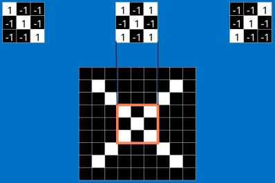

**卷积神经网络CNN浅析**

**我建议你先把CNN当作一个黑盒子，不要关心为什么，只关心结果。**

这里借用了一个分辨X和o的例子来这里看原文，就是每次给你一张图，你需要判断它是否含有"X"或者"O"。并且假设必须两者选其一，不是"X"就是"O"。

下面看一下CNN是怎么分辨输入的图像是x还是o，如果需要你来编程分辨图像是x还是o，你会怎么做？可能你第一时间就想到了逐个像素点对比。但是，如果图片稍微有点变化呢？像是下面这个x，它不是标准的x，我们可以分辨它是x，但是对于计算机而言，它就只是一个二维矩阵，逐个像素点对比肯定是不行的。

CNN就是用于解决这类问题的，它不在意具体每个点的像素，而是通过一种叫卷积的手段，去提取图片的特征。

**卷积层**

所以对于CNN而言，第一步就是提取特征，卷积就是提取猜测特征的神奇手段。而我们不需要指定特征，任凭它自己去猜测，就像上图，我们只需要告诉它，我们喜欢左边的，不喜欢右边的，然后它就去猜测，区分喜不喜欢的特征

假设，我们上面这个例子，CNN对于X的猜测特征如上，现在要通过这些特征来分类。

计算机对于图像的认知是在矩阵上的，每一张图片有rgb二维矩阵（不考虑透明度）所以，一张图片，应该是3x高度x宽度的矩阵。而我们这个例子就只有黑白，所以可以简单标记1为白，-1为黑。是个9x9的二维矩阵。

我们把上面的三个特征作为卷积核(我们这里是假设已经训练好了CNN，训练提出的特征就是上面三个，我们可以通过这三个特征去分类
X )，去和输入的图像做卷积(特征的匹配)。

看完上面的，估计你也能看出特征是如何去匹配输入的，这就是一个卷积的过程，具体的卷积计算过程如下(只展示部分)：

把计算出的结果填入新的矩阵

**其他部分也是相同的计算**

**最后，我们整张图用卷积核计算完成后：**

**三个特征都计算完成后：**

不断地重复着上述过程，将卷积核（特征）和图中每一块进行卷积操作。最后我们会得到一个新的二维数组。其中的值，越接近为1表示对应位置的匹配度高，越是接近-1，表示对应位置与特征的反面更匹配，而值接近0的表示对应位置没有什么关联。

**以上就是我们的卷积层，通过特征卷积，输出一个新的矩阵给下一层。**

**池化层**

在图像经过以上的卷积层后，得到了一个新的矩阵，而矩阵的大小，则取决于卷积核的大小，和边缘的填充方式，总之，在这个XXOO的例子中，我们得到了7x7的矩阵。池化就是缩减图像尺寸和像素关联性的操作，只保留我们感兴趣（对于分类有意义）的信息。

常用的就是2x2的最大池。

看完上面的图，你应该知道池化是什么操作了。

通常情况下，我们使用的都是2x2的最大池，就是在2x2的范围内，取最大值。因为最大池化（max-pooling）保留了每一个小块内的最大值，所以它相当于保留了这一块最佳的匹配结果（因为值越接近1表示匹配越好）。这也就意味着它不会具体关注窗口内到底是哪一个地方匹配了，而只关注是不是有某个地方匹配上了。

这也就能够看出，CNN能够发现图像中是否具有某种特征，而不用在意到底在哪里具有这种特征。这也就能够帮助解决之前提到的计算机逐一像素匹配的死板做法。

同样的操作以后，我们就输出了3个4x4的矩阵。

**全连接层**

全连接层一般是为了展平数据，输出最终分类结果前的归一化。
我们把上面得到的4x4矩阵再卷积+池化，得到2x2的矩阵

全连接就是这样子，展开数据，形成1xn的'条'型矩阵。

然后再把全连接层连接到输出层。之前我们就说过，这里的数值，越接近1表示关联度越大，然后我们根据这些关联度，分辨到底是O还是X.

看上图（圈圈里面的几个关键信息点），这里有个新的图像丢进我们的CNN了，根据卷积\>池化\>卷积\>池化\>全连接的步骤，我们得到了新的全连接数据，然后去跟我们的标准比对，得出相似度，可以看到，相似度是X的为0.92
所以，我们认为这个输入是X。

一个基本的卷积神经网络就是这样子的。回顾一下，它的结构：

Relu是常用的激活函数，所做的工作就是max(0,x)，就是输入大于零，原样输出，小于零输出零。
